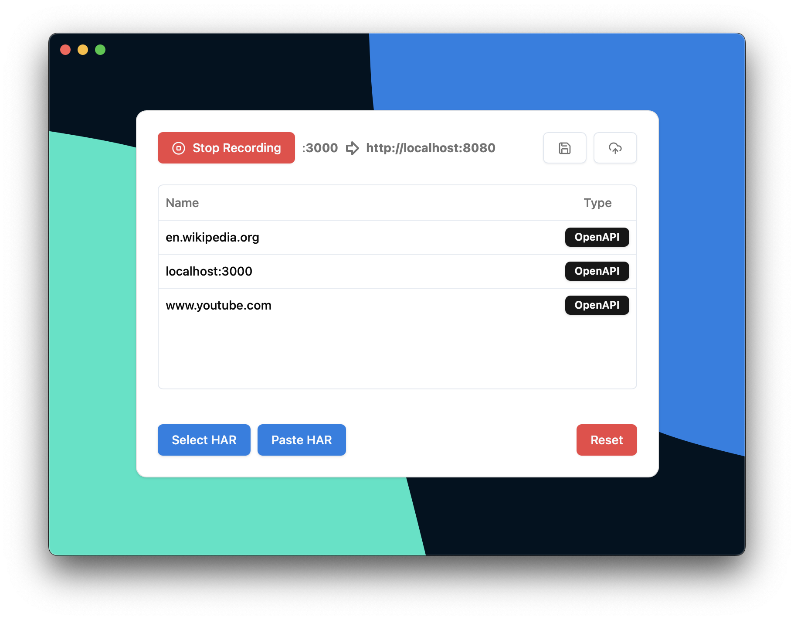
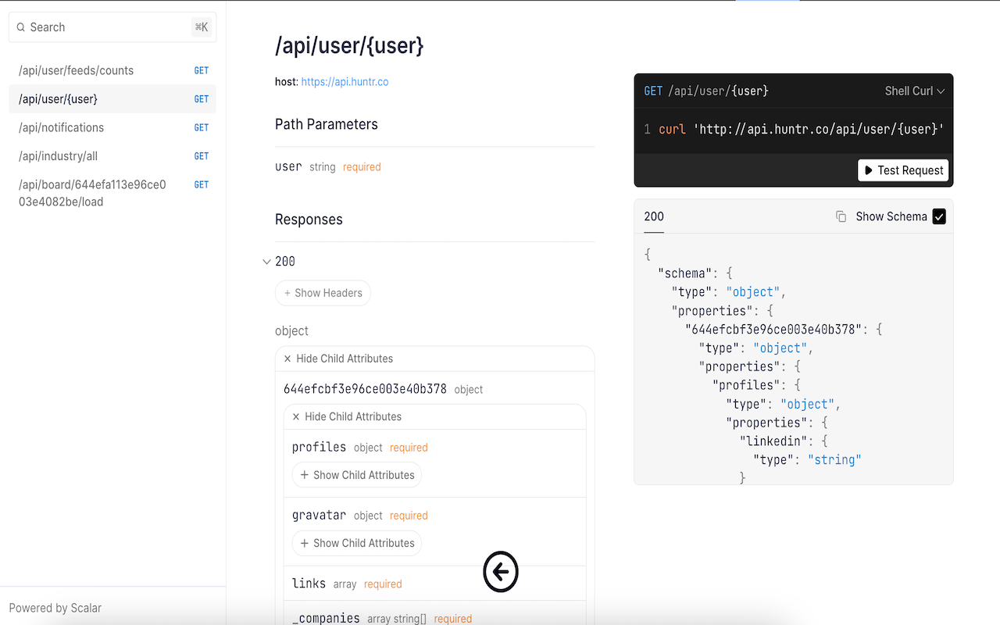
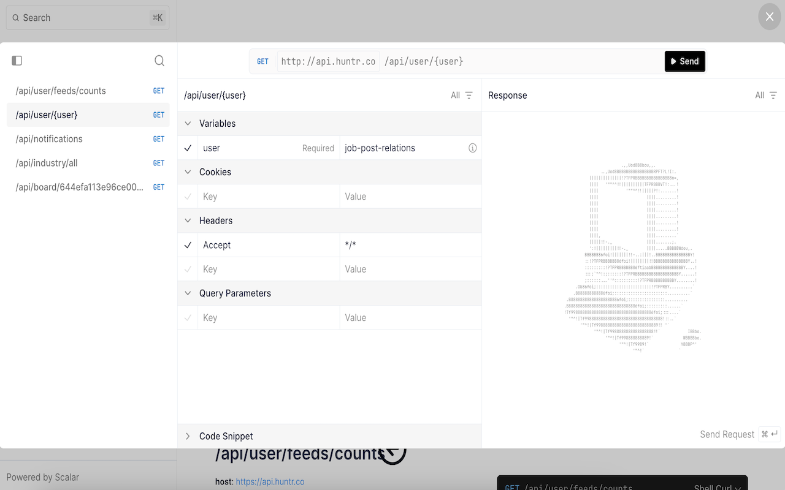

<a id="readme-top"></a>

<!-- Ref: https://inttter.github.io/md-badges -->
<!-- Ref: https://simpleicons.org             -->

[![Download for Windows][windows-shield]][windows-url]
[![Download for Mac][mac-shield]][mac-url]
[![Download for Linux][linux-shield]][linux-url]

[![Download in the Chrome Web Store][chrome-shield]][chrome-url]
[![Download in the Firefox Add-on Store][firefox-shield]][firefox-url]
<!-- [![Download in the Edge Add-on Store][edge-shield]][edge-url] -->

[![Download the npm library][library-shield]][library-url]
[![Use the CLI tool][cli-shield]][cli-url]

[![MIT License][license-shield]][license-url]

<!-- PROJECT LOGO -->
<br />
<div align="center">
  <a href="example.com">
    
  </a>

<h3 align="center">Demystify</h3>

  <p align="center">
    Generate API Specifications in Real Time for Any API
    <br />
    <a href="https://github.com/AndrewWalsh/demystify"><strong>Understand API Behaviour »</strong></a>
    <br />
    <br />
    <a href="https://andrewwalsh.github.io/demystify">View Demo</a>
    &middot;
    <a href="https://github.com/AndrewWalsh/demystify/issues/new?labels=bug">Report Bug</a>
    &middot;
    <a href="https://github.com/AndrewWalsh/demystify/issues/new?labels=enhancement">Request Feature</a>
  </p>
</div>


<!-- TABLE OF CONTENTS -->
<details open>
  <summary>Table of Contents</summary>
  <ol>
    <li>
      <a href="#about-the-project">About The Project</a>
    </li>
    <li>
      <a href="#getting-started">Getting Started</a>
      <ul>
        <li>
          <a href="#desktop">Desktop App</a>
          <ul>
            <li><a href="#mac">Mac</a></li>
            <li><a href="#linux">Linux</a></li>
            <li><a href="#windows">Windows</a></li>
          </ul>
        </li>
        <li>
          <a href="#browser-extension">Browser Extension<a>
          <ul>
            <li><a href="#chrome">Chrome</a></li>
            <li><a href="#firefox">Firefox</a></li>
          </ul>
        </li>
        <li><a href="#cli">CLI</a></li>
        <li><a href="#library">Library</a></li>
      </ul>
    </li>
    <li><a href="#screenshots">Screenshots</a></li>
    <li><a href="#contributing">Contributing</a></li>
    <li><a href="#license">License</a></li>
  </ol>
</details>


<!-- ABOUT THE PROJECT -->
## About The Project

https://github.com/user-attachments/assets/093488b6-83b9-4f72-8f23-59676f0ad963

Demystify is a suite of tools designed to help understand API behaviour. It generates accurate OpenAPI 3.1 specifications in real time from live network traffic or HAR files. The desktop app achieves this with a built-in proxy, while the browser extension works automatically for all requests in a given tab. The CLI tool works directly on files, and the library can be used in other contexts such as middleware to programmatically generate API specifications.

It identifies path parameters automatically without manual intervention. Data in the generated specification reflects all observed information across multiple status codes and mime types for request and response headers, bodies, query parameters, path parameters, and cookies for each endpoint.


<p align="right">(<a href="#readme-top">back to top</a>)</p>


<!-- GETTING STARTED -->
## Getting Started

Demystify is available in a variety of formats on various platforms.

### Desktop

The desktop app has a built in proxy that captures network traffic and generates OpenAPI specifications in real time. It is designed to be simple and quick to use, and specifies a local port to listen to and a local or remote host to forward to.

#### Mac

[![Download for Mac][mac-shield]][mac-url]

#### Linux

[![Download for Linux][linux-shield]][linux-url]

#### Windows

[![Download for Windows][windows-shield]][windows-url]

### Browser Extension

The browser extension can be accessed in the DevTools of your chosen browser. While the tool is open it will record all network requests in the same tab and generate OpenAPI specifications in real time from network traffic.

#### Chrome

> I have submitted this to Chrome Web Store and am awaiting approval. After that the link will be updated.

Locate the tool in [Chrome DevTools](https://developer.chrome.com/docs/devtools).

[![Download in the Chrome Web Store][chrome-shield]][chrome-url]

#### Firefox

Locate the tool in [Firefox DevTools](https://firefox-source-docs.mozilla.org/devtools-user/).

[![Download in the Firefox Add-on Store][firefox-shield]][firefox-url]

### CLI

[![Use the CLI tool][cli-shield]][cli-url]

```sh
npx demystify --input <somefile.har>
```

```
Usage: demystify [options]

Example: demystify --input ./example.har

Options:
  -h, --help                 Show help information
  -i, --input  <string>      A path to a HTTP Archive file (HAR)
  -s, --stdout <boolean>     Optional: when "true", write a JSON array to stdout instead of writing files

This command writes OpenAPI 3.1 specifications to the current directory
Names of these files follow the convention {host}.{type}.json

Example host: api.example.com
Example type: openapi
```

### Library

[![Download the npm library][library-shield]][library-url]

```sh
npm install demystify-lib
```

```typescript
import { Representor } from "demystify-lib";
// Instantiate the representor
// Which "represents" an API in a particular way, such as OpenAPI or GraphQL
const representor = new Representor();
// Call upsert with a valid HAR entry to add it to the representor
// Repeat as many times as desired
representor.upsert(/* harEntry */);
// Call generate on the rest property of representor to generate OpenAPI documents
const doc = representor.rest.generate();
```

See test files for more information on usage.


<p align="right">(<a href="#readme-top">back to top</a>)</p>


<!-- SCREENSHOTS -->
## Screenshots

<div align="center">
  <div align="center">
    
    <p>Watch live network traffic or a HAR file become API specifications<br/> that update in real time in response to new requests</p>
  </div>

  <br />
  <div align="center">
    
    <p>Demystify identifies path parameters in the underlying API automatically<br/> and reveals its underlying contract</p>
  </div>

  <br />
  <div align="center">
    
    <p>The browser extension can use <a href="https://github.com/scalar/scalar">Scalar's</a> built in API client<br/>with prepopulated fields froms recent values</p>
  </div>
</div>

<p align="right">(<a href="#readme-top">back to top</a>)</p>


<!-- CONTRIBUTING -->
## Contributing

Contributions are what make the open source community such an amazing place to learn, inspire, and create. Any contributions you make are **greatly appreciated**.

If you have a suggestion that would make this better, please fork the repo and create a pull request. You can also simply open an issue with the tag "enhancement".

1. Fork the Project
2. Create your Feature Branch (`git checkout -b feature/AmazingFeature`)
3. Commit your Changes (`git commit -m 'Add some AmazingFeature'`)
4. Push to the Branch (`git push origin feature/AmazingFeature`)
5. Open a Pull Request

<p align="right">(<a href="#readme-top">back to top</a>)</p>


<!-- LICENSE -->
## License

Distributed under the MIT License. See `LICENSE.txt` for more information.

<p align="right">(<a href="#readme-top">back to top</a>)</p>


<!-- MARKDOWN LINKS & IMAGES -->
<!-- https://www.markdownguide.org/basic-syntax/#reference-style-links -->
<!-- License -->
[license-url]: https://github.com/AndrewWalsh/demystify/blob/main/LICENSE.txt
[license-shield]: https://img.shields.io/github/license/AndrewWalsh/demystify
<!-- Browser -->
[chrome-url]: / 
[chrome-shield]: https://img.shields.io/badge/Google%20Chrome-4285F4?logo=GoogleChrome&logoColor=white
[firefox-url]: https://addons.mozilla.org/en-US/firefox/addon/demystify
[firefox-shield]: https://img.shields.io/badge/Firefox-FF7139?logo=FirefoxBrowser&logoColor=white
[edge-url]: /
[edge-shield]: https://img.shields.io/badge/Edge-0078d7?logo=e&logoColor=white
<!-- Desktop -->
[mac-url]: https://github.com/AndrewWalsh/demystify/releases
[mac-shield]: https://img.shields.io/badge/macOS-000000?logo=apple&logoColor=F0F0F0
[linux-url]: https://github.com/AndrewWalsh/demystify/releases
[linux-shield]: https://img.shields.io/badge/Linux-FCC624?logo=linux&logoColor=black
[windows-url]: https://github.com/AndrewWalsh/demystify/releases
[windows-shield]: https://custom-icon-badges.demolab.com/badge/Windows-0078D6?logo=windows11&logoColor=white
<!-- Library -->
[library-url]: https://www.npmjs.com/package/demystify-lib
[library-shield]: https://img.shields.io/badge/npm-CB3837?logo=npm&logoColor=fff
<!-- CLI -->
[cli-url]: https://www.npmjs.com/package/demystify
[cli-shield]: https://img.shields.io/badge/npx-6DA55F?logo=iTerm2&logoColor=fff
